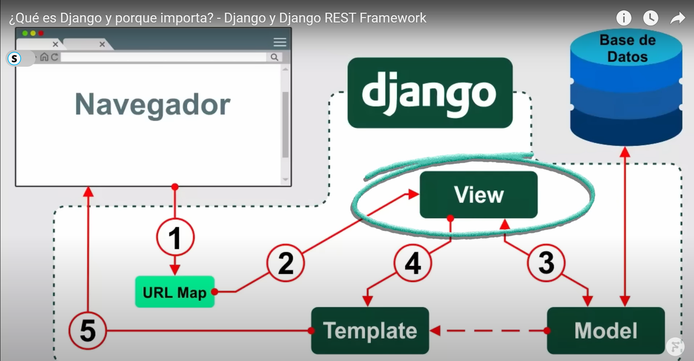

# Notas personales
Patrón Model View Template (MVT)



para correr el servidor<br>
python .\manage.py runserver<br>

------------------ crearApp nombreApp <br>
python .\manage.py startapp webapp <br>

archivo __init__ no debe cambiar, para indicar que es un paquete de Python
archivo views.py se agrega el código para el navegador web
Registrar la app: capeta sap>settings.py<br>
    en installed_apps, se agregan las aplicaciones web, en este caso webapp <br>

archivo urls.py: mapeo de urls, ahí se agregan las rutas a las que se puede acceder desde la webapp.
se debe agregar en el archivo de ```views.py``` dentro de la carpteta de la app (webserver)

OJO! Indicar la ruta del código fuente, con Mark Directory as > Sources Root <br>

### Conexión con la Base de Datos DE PostgreSQL
1. Agregar databases 
2. En sap > settigs.py
   3. buscar DATABASES <br>
   ```
   DATABASES = {
    'default': {
        'ENGINE': 'django.db.backends.postgresql_psycopg2',
        'NAME': 'sap_db',
        'USER': 'postgres',
        'PASSWORD': 'admin',
        'HOST': 'localhost',
        'PORT': '5432'
    }
   ```
   4. Instalar conector hacia PostgreSQL <br>
   ```python -m pip install psycopg2```

### Migraciones
En el archivo de setting.py, ya hay aplicaciones instaladas como app de admin,
estas aplicaciones se configurar en la BD. 

si se corre el servidor, puede mandar el siguiente mensaje
"You have 18 unapplied migration(s)." <br>

```python manage.py showmigrations```

### Sincronización con la BD <br>
```python .\manage.py migrate``` <br>

## Creación de clases (tablas)
Se crear una app llamada "personas", dejar sólo archivos de models, views y directorio migrations
Agregar clases en el archivo personas\models.py

[Ver documentación de Field de Django](https://docs.djangoproject.com/en/4.2/ref/models/fields/)
<br>
Genera los archivos que debe ejecutar en la BD, así convierte una clase a una tabla de la BD <br>
 ```python .\manage.py makemigrations``` <br>

### SQL que se ejecuta en la BD
Creación de la tabla *personas* con el nombre de la migración a ejecutar (sólo con los primeros caracteres).<br>
```python .\manage.py sqlmigrate personas 0001``` <br>

Respuesta en terminal:
```
CREATE TABLE "personas_persona" ("id" bigint NOT NULL PRIMARY KEY GENERATED BY DEFAULT AS IDENTITY, "nombre" varchar(255) NOT NULL, "apellido" varchar(255) NOT NULL, "email" varchar(255) NOT NULL);
COMMIT;
```
El nombre de la tabla *personas_persona*, inicia con el nombre de la app y posteriormente el nombre del modelo.
Genera la llave primaria en automático. <br>
Al final genera un COMMIT

### Guardar en BD
```python .\manage.py migrate``` <br>